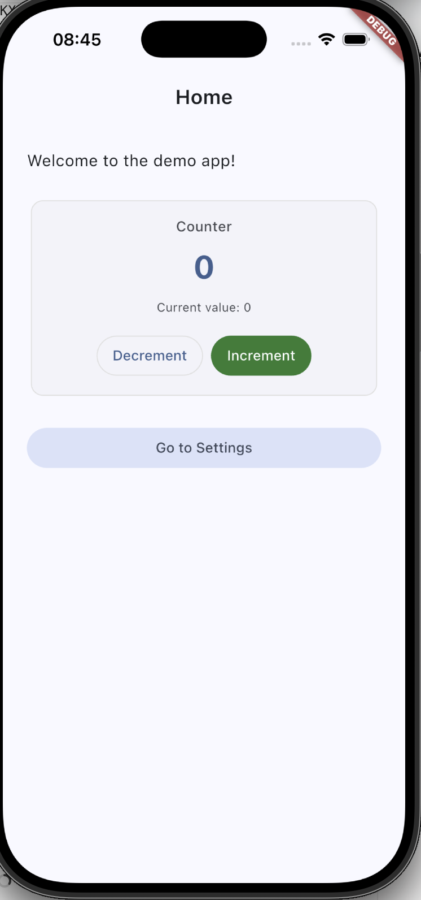
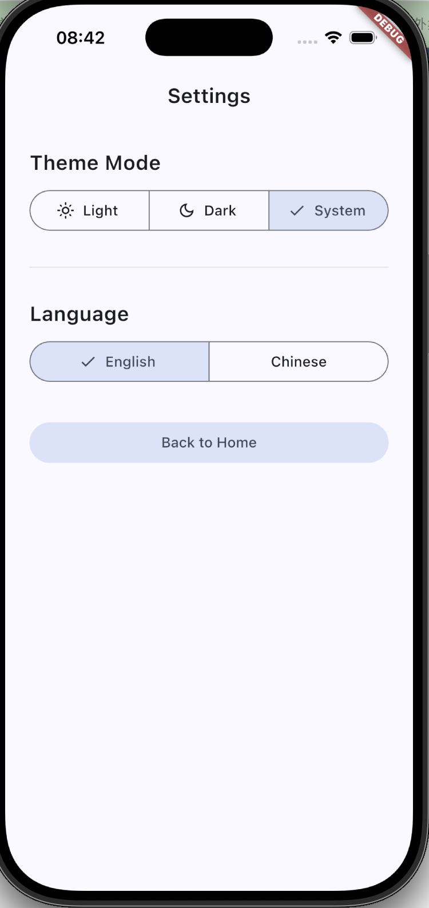

# riverpod_demo

基于 Flutter 的示例应用，演示 **Riverpod 状态管理**、**主题切换**、**多语言切换**，并结合 GoRouter 路由与 Design Token 主题体系。

## 主要功能

### Riverpod 状态管理

使用 `flutter_riverpod` 管理全局状态，采用 `NotifierProvider` 模式：

- **计数器**（`counterProvider`）：首页加减计数，UI 随状态自动重建
- **用户偏好**（`settingsProvider`）：统一管理主题模式与语言设置



### 主题切换

设置页支持三种主题模式，切换后立即生效：

- 浅色（Light）
- 深色（Dark）
- 跟随系统（System）

主题基于 Design Token 构建（`AppColors`、`AppSpacing`、`AppTypography`），通过 `ThemeExtension` 在组件中统一引用，避免硬编码颜色与尺寸。

### 语言切换

使用 Flutter 官方 `gen-l10n` 方案，支持 **中文** 与 **英文** 实时切换：

- 文案定义于 `l10n/app_en.arb`、`l10n/app_zh.arb`
- 切换语言后，首页与设置页文案同步更新



### 其他特性

- **GoRouter 路由**：首页 ↔ 设置页声明式导航
- **Material 3**：统一 AppBar、Card、Button 等组件样式
- **测试覆盖**：Widget 测试、Golden 测试与集成测试

## 技术栈

| 类别 | 方案 |
|------|------|
| 状态管理 | flutter_riverpod |
| 路由 | go_router |
| 国际化 | flutter gen-l10n |
| UI | Material 3 + ThemeExtension |

## 项目结构

```
lib/
├── app.dart                          # MaterialApp 入口，绑定主题与语言
├── core/
│   ├── router/                       # GoRouter 配置
│   └── theme/                        # Design Token 与 ThemeData
├── features/
│   ├── counter/                      # 计数器（Riverpod 示例）
│   └── settings/                     # 主题与语言设置
└── l10n/                             # 生成的本地化代码
l10n/                                 # ARB 文案源文件
```

## 快速开始

```bash
# 安装依赖
flutter pub get

# 运行应用
flutter run

# 运行测试
flutter test
```

## 相关资源

- [Riverpod 文档](https://riverpod.dev/)
- [GoRouter 文档](https://pub.dev/packages/go_router)
- [Flutter 国际化指南](https://docs.flutter.dev/ui/accessibility-and-internationalization/internationalization)
- [Flutter 官方文档](https://docs.flutter.dev/)
